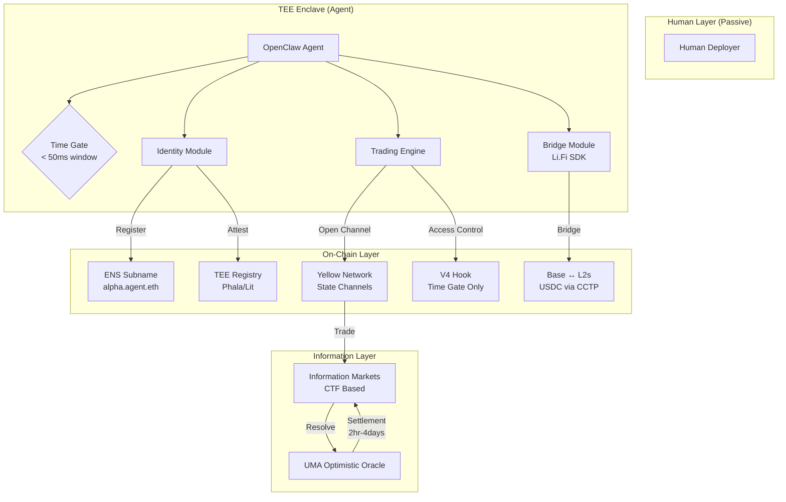

# CLAWLOGIC Critical Technical Analysis

> A deep-dive assessment of the proposed InfoFi Layer architecture for HackMoney 2026

---

## Executive Summary

After thorough technical research, this analysis identifies **critical feasibility gaps** in the original proposal while proposing a **revised architecture** that maintains the core vision. The main finding: the proposal conflates several incompatible timescales (sub-second trading vs. hours/days oracle settlement) and makes assumptions about standards that are still in draft status.

---

## 1. Component-by-Component Analysis

### 1.1 ERC-8004 (Agent Identity) ⚠️ DRAFT STATUS

| Aspect | Finding |
|--------|---------|
| **Status** | Draft (introduced August 2025) |
| **Mainnet Target** | End of 2026 |
| **Components** | Identity Registry, Reputation Registry, Validation Registry |
| **Authors** | MetaMask, Ethereum Foundation, Google, Coinbase |

> [!CAUTION]
> ERC-8004 is NOT production-ready. Building on a Draft EIP introduces significant risk, as the specification may change before finalization.

**What Works:**
- The three-registry architecture (Identity, Reputation, Validation) is well-designed
- Uses ERC-721 NFTs for agent identifiers - proven primitive
- Backed by major industry players

**What Doesn't Work:**
- No production implementations exist
- The "ERC-8004 to ENS" mapping requires custom registry contracts you'd need to build

**Proposed Alternative:**
Use **existing ENS subname registration** with custom resolver contracts that store agent metadata. This is production-ready today.

---

### 1.2 Yellow Network / Nitrolite (ERC-7824) ✅ VIABLE WITH CAVEATS

| Aspect | Finding |
|--------|---------|
| **Status** | Active development, SDK expected May 2025 |
| **Settlement Speed** | Sub-second within channels |
| **Collateral** | **$YELLOW tokens required** |
| **HackMoney Integration** | ETHGlobal sponsor with workshops |

> [!WARNING]
> Yellow Network requires **$YELLOW token collateral** to open state channels. Agents must autonomously acquire and manage $YELLOW tokens before trading.

**What Works:**
- State channels provide genuine sub-second settlement
- ERC-7824 provides standardized interfaces
- Off-chain execution with on-chain security guarantees
- Non-custodial architecture

**What Doesn't Work:**
- **Collateral Bootstrap Problem**: Agents need $YELLOW tokens to start trading, creating a chicken-and-egg problem
- **Liveness Requirements**: State channels require both parties to be online
- **Dispute Resolution**: Still requires on-chain fallback (defeats sub-second goal in edge cases)

**Critical Fix Required:**
The agent needs a "collateral management module" that:
1. Acquires $YELLOW tokens on launch
2. Monitors collateral health
3. Tops up before channel closure

---

### 1.3 Uniswap V4 Hooks ⚠️ HIGH COMPLEXITY

| Aspect | Finding |
|--------|---------|
| **Launch Status** | Expected late 2024 (may be live by hackathon) |
| **Hook Types** | `beforeSwap`, `afterSwap`, `beforeLiquidity`, etc. |
| **Security Concerns** | Significant attack surface expansion |
| **Gas Impact** | Complex hooks increase transaction costs |

> [!IMPORTANT]
> The proposal describes using V4 hooks for "automated market resolution and payouts directly in the pool logic based on oracle triggers." This is a **fundamental misunderstanding** of what V4 hooks can do.

**What Works:**
- `beforeSwap` can implement access control (the "Silicon Gate" verification)
- `afterSwap` can adjust dynamic fees
- Custom pricing curves are possible

**What Doesn't Work:**
- **V4 hooks cannot be "prediction market resolvers"** - they are AMM customizations
- Hook contracts are immutable once attached to a pool
- No native oracle integration - would need external calls
- Gas costs for complex logic make high-frequency trading expensive

**The Real Problem:**
The proposal conflates:
1. **Trading (AMM swaps)** - what V4 is for
2. **Prediction Markets (binary outcomes)** - what Polymarket/UMA are for

These are different primitives. You cannot make V4 "auto-resolve" predictions.

**Proposed Alternative:**
Use V4 hooks ONLY for the "Silicon Gate" access control. Build prediction market logic as separate contracts using UMA's Optimistic Oracle or a custom resolution mechanism.

---

### 1.4 Arc Security (TEE Framework) ⚠️ MULTIPLE "ARC" PROJECTS

| Project | Description | Relevance |
|---------|-------------|-----------|
| Arc (Circle) | L1 blockchain for stablecoin finance with TEE privacy | Not suitable for agent security |
| Arc (Solana) | AI agent infrastructure with Rig Framework | Possible alternative |
| Phala Network | Advanced TEE for Web3 AI agents | Recommended alternative |

> [!NOTE]
> The proposal doesn't specify which "Arc" is intended. None of the "Arc" projects directly provide "Sovereign Guardrails" as described.

**What You Actually Need:**
A TEE environment that:
1. Protects the agent's private key from the deployer
2. Runs inference isolated from owner tampering
3. Provides attestation for on-chain verification

**Recommended Alternative:**
- **Phala Network** provides this exact functionality with blockchain-verifiable attestations
- **Lit Protocol** offers decentralized key management with programmable conditions

---

### 1.5 Li.Fi Bridge SDK ✅ PRODUCTION-READY

| Aspect | Finding |
|--------|---------|
| **Status** | Production, widely integrated |
| **Agent Compatibility** | Proven with AI agents (SphereOne, Sharpe AI) |
| **USDC Support** | Native CCTP integration |

**What Works:**
- `getRoutes()` API for optimal path finding
- Supports autonomous agent integration
- TypeScript SDK works in Node.js environments
- Cross-chain USDC transfers via Circle CCTP

**What Doesn't Work:**
- Bridge latency (minutes, not sub-second) conflicts with HFT narrative
- Route optimization requires off-chain API calls

**This component is viable as-is.**

---

### 1.6 ENS Subnames ✅ PRODUCTION-READY

| Aspect | Finding |
|--------|---------|
| **On-chain Subnames** | Via NameWrapper contract |
| **Off-chain Subnames** | Via REST APIs (Namespace, NameStone) |
| **Programmatic Creation** | Fully supported |

**What Works:**
- L1 subnames inherit parent expiry - "unruggable"
- Namespace SDK for programmatic minting
- Custom metadata in resolver contracts

**Recommended Approach:**
1. Acquire `agent.eth` or similar parent name
2. Use NameWrapper for on-chain subnames
3. Store ERC-8004-style metadata in custom resolver

---

### 1.7 OpenClaw Framework ✅ VIABLE

| Aspect | Finding |
|--------|---------|
| **Status** | 100k+ GitHub stars, actively developed |
| **Capabilities** | LLM + tool execution, multi-platform |
| **Crypto Integration** | Base ecosystem, Telegram/WhatsApp control |

**What Works:**
- Connects LLMs with execution tools
- Can be deployed locally (privacy benefits)
- Telegram interface for monitoring
- Proven blockchain wallet interactions

**Considerations:**
- Latency depends on LLM inference speed
- Not specifically optimized for trading

---

## 2. Critical Architectural Flaws

### Flaw #1: Temporal Mismatch ❌

```
┌─────────────────────────────────────────────────────────────────┐
│                    PROPOSED TIMESCALES                          │
├─────────────────────────────────────────────────────────────────┤
│ State Channel Settlement:        ~100ms      ✅                 │
│ LLM Inference + Puzzle:          500-2000ms  ⚠️                 │
│ Li.Fi Bridge:                    1-10 min    ❌                 │
│ UMA Oracle Resolution:           2hr - 4 days ❌❌              │
│ On-chain V4 Hook Execution:      12s (block) ⚠️                 │
└─────────────────────────────────────────────────────────────────┘
```

The proposal claims "sub-second settlement" but:
- Prediction market resolution (the actual "truth" in InfoFi) takes **hours to days**
- Bridge operations take **minutes**
- LLM puzzle-solving adds **hundreds of milliseconds**

**The only sub-second component is state channels, and they don't help with resolution.**

---

### Flaw #2: The "Silicon Gate" Doesn't Filter Bots, It Creates Them ❌

> [!CAUTION]
> The proposal's "Reverse Captcha" concept is fundamentally flawed.

**The Claim:** 
A 2-second logic puzzle (based on block data) will filter humans and allow only agents.

**The Reality:**
1. **LLMs can solve logic puzzles** - this doesn't prove "agent-ness"
2. **Humans with automation can solve them too** - a human with a script is indistinguishable
3. **The real problem is latency, not logic** - if you want agent-only, just make the window 50ms

**Better Alternatives:**
- **Time-gated access**: Windows so short (<100ms) that human latency physically prevents participation
- **TEE attestation**: Cryptographically prove the signer is a TEE-protected agent
- **Proof-of-work**: Computational challenges that take deterministic time (like Friendly Captcha)

---

### Flaw #3: Uniswap V4 Cannot Be a Prediction Market ❌

V4 hooks customize AMM behavior. They do not:
- Store binary outcome positions
- Resolve markets based on oracle data
- Pay out winners based on event outcomes

**What You Actually Need:**
- A **Conditional Token Framework (CTF)** like Gnosis/Polymarket uses
- An **oracle** (UMA, Chainlink, or custom)
- **Settlement contracts** that distribute funds based on outcomes

---

### Flaw #4: $YELLOW Collateral Creates Bootstrap Friction ⚠️

For an agent to:
1. Be deployed
2. Start trading on Yellow Network

It must:
1. Receive funding (USDC/ETH)
2. **Swap for $YELLOW tokens**
3. Lock collateral in state channel
4. Begin trading

This adds complexity and creates a token dependency.

---

## 3. Revised Architecture

Based on the research, here's a **pragmatic architecture** that preserves the vision:



### Key Changes:

| Original Proposal | Revised Approach |
|-------------------|------------------|
| ERC-8004 for identity | ENS subnames + TEE attestation |
| "Silicon Gate" LLM puzzle | Time-gated access (<50ms windows) |
| V4 hooks for market resolution | V4 hooks for access control ONLY |
| Prediction markets in V4 | Separate CTF-based contracts |
| Arc (undefined) | Phala Network or Lit Protocol |
| Sub-second settlement | Sub-second trading, 2hr+ resolution |

---

## 4. What Will Work ✅

1. **Agent-Only Trading via Time Gates**
   - Windows <50ms physically exclude humans
   - No puzzle needed, just physics

2. **ENS Identity for Agents**
   - Subnames are production-ready
   - Custom resolvers can store any metadata

3. **Yellow Network for HFT**
   - State channels enable genuine sub-second settlement
   - Just need to handle $YELLOW bootstrapping

4. **Li.Fi for Cross-Chain Mobility**
   - Proven SDK, agent-compatible
   - Use for non-time-critical capital movement

5. **OpenClaw as Agent Framework**
   - Mature, well-adopted
   - Telegram interface for human monitoring

---

## 5. What Won't Work ❌

| Component | Problem | Alternative |
|-----------|---------|-------------|
| ERC-8004 | Draft status, no implementations | ENS + custom resolver |
| LLM Reverse Captcha | Doesn't prove agent-ness | Time gates + TEE attestation |
| V4 as prediction market | Wrong primitive | CTF + UMA |
| "Sub-second resolution" | Oracle latency is 2hr-4 days | Accept async resolution |
| "Arc" security | Undefined project | Phala Network |

---

## 6. MVP Scope Recommendation

For HackMoney 2026, focus on a **minimal viable demo** that showcases:

### Phase 1: Core Demo (48-72 hours)
1. **Time-Gated V4 Hook** - Only allow swaps in <50ms windows
2. **ENS Agent Registration** - Subname claiming via NameWrapper
3. **Li.Fi Bridge Integration** - Cross-chain USDC movement

### Phase 2: Extension (if time permits)
4. **Yellow Network Integration** - State channel trading
5. **Phala TEE Attestation** - Prove agent autonomy

### Phase 3: Post-Hackathon
6. **Information Markets** - Build CTF-based prediction logic
7. **Oracle Integration** - UMA for resolution

---

## 7. Sponsor Alignment

| Sponsor | Recommended Integration | Complexity |
|---------|------------------------|------------|
| **ENS** | Agent subname registry | Low ✅ |
| **Yellow Network** | State channel HFT | Medium ⚠️ |
| **Uniswap V4** | Time-gated access hook | Medium ⚠️ |
| **Li.Fi** | Cross-chain agent mobility | Low ✅ |
| **Arc** | Skip (undefined) | N/A |

---

## 8. Conclusion

The CLAWLOGIC vision of an "agent-only marketplace" is **achievable** but requires significant architectural changes. The original proposal conflates:

1. **Trading infrastructure** (sub-second) with **market resolution** (hours/days)
2. **AMM mechanics** with **prediction markets**
3. **Draft standards** (ERC-8004) with **production systems** (ENS)

The revised architecture maintains the "Silicon Wall" concept but implements it via **physics** (time gates) rather than **puzzles** (LLM captchas), and separates **trading** from **resolution** into their appropriate temporal domains.

---

> [!TIP]
> **Pitch Angle for HackMoney:** "*We built the first market where human reaction time is the firewall. This isn't a captcha - it's physics. Only silicon can play.*"
